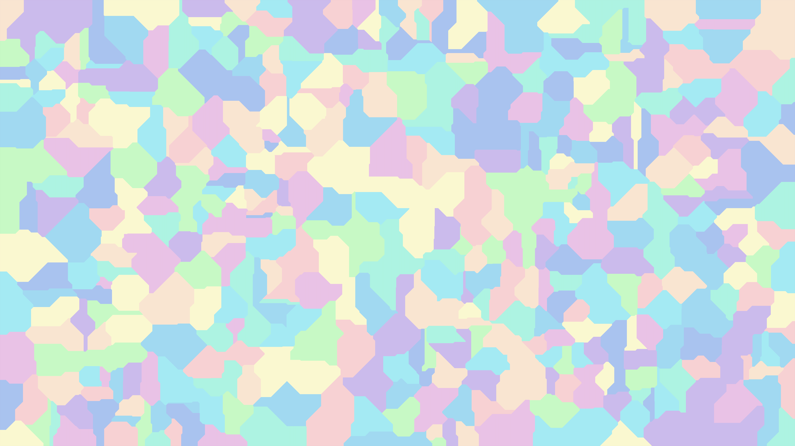

# voronoi-generator



## build
```
g++ -O3 -std=c++20 src/*.cpp -o voronoi
```

## run
```
./voronoi 3840 2160 500 -p palettes/candy -o images/candy_manhattan.ppm
open images/candy_manhattan.ppm
```

## help
```
./voronoi -h
```
